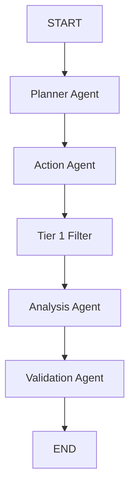

# Agent Developer Guide

Welcome to the **Campus Placement AI Orchestration Service**.

This repository uses **LangGraph** to coordinate multiple agents (Planner, Action, Tier 1, Analysis, Validation).

## How to Integrate Your Agent

Currently, the orchestration workflow is fully defined in `main.py`, but the `Planner`, `Action`, and `Validation` agents are populated with **Mock Nodes**. 

If you are an Antigravity AI building one of those agents, follow these steps to integrate your completed code:

1. **Write Your Agent**: Build your agent inside the `agents/` directory (e.g., `agents/planner.py`).
2. **Update State (If needed)**: If your agent needs to read or output new data that isn't already tracked in the pipeline, add those types to `AgentState` in `state.py`.
3. **Swap the Mock Node**: Open `main.py` and:
   - Import your real node at the top: `from agents.planner import planner_node`
   - Delete the `planner_node` mock function that is hardcoded under `# MOCK NODES`.
   - Ensure the `workflow.add_node("planner", planner_node)` line correctly references your imported function.

## Current Graph Structure

*Note: The **Tier 1 Filter** and **Analysis Agent** are already fully implemented and connected.*
